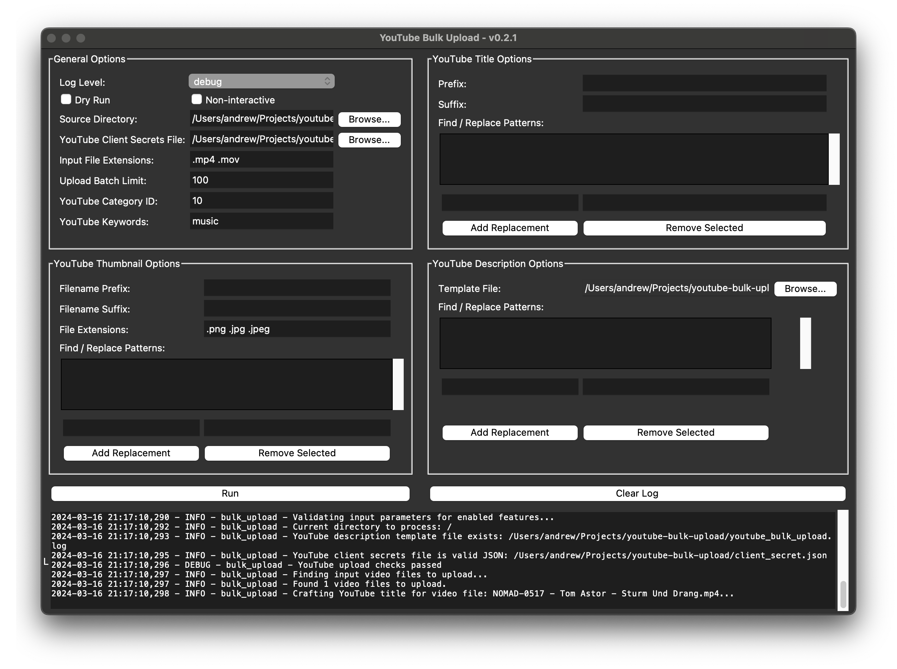

# YouTube Bulk Upload 🎥🔺


**YouTube Bulk Upload** is a Python tool designed to facilitate the bulk uploading of video files to YouTube. This can be particularly useful for repopulating a channel after it has been unfairly terminated or when migrating content. The tool offers both a Command Line Interface (CLI) and a Graphical User Interface (GUI) to cater to different user preferences.


## Features
- Bulk upload videos to YouTube from a specified directory.
- Customize video metadata, including titles, descriptions, and keywords.
- Dry run mode to preview actions without making changes.
- Non-interactive mode for automated processes.
- Support for thumbnail customization.

## Installation
To install YouTube Bulk Upload, ensure you have Python 3.9 or newer installed on your system. You can then install the tool using pip:

```bash
pip install youtube-bulk-upload
```

This command installs the latest version of YouTube Bulk Upload along with its dependencies.

## Using the CLI
The CLI offers a straightforward way to use YouTube Bulk Upload from your terminal or command prompt.
Basic Usage
To start a bulk upload with the default settings, navigate to the directory containing your video files and run:

```bash
youtube-bulk-upload
```

### Customizing Uploads
You can customize your uploads using various command-line arguments. For example, to specify a source directory and limit the number of uploads:

```bash
youtube-bulk-upload --source_directory "/path/to/videos" --upload_batch_limit 50
```

Refer to the CLI help for more options:

```bash
youtube-bulk-upload --help
```

## Using the GUI



For those who prefer a graphical interface, YouTube Bulk Upload provides a GUI that can be launched with the following command:

```bash
youtube-bulk-upload-gui
```

The GUI allows you to configure all the options available in the CLI through a user-friendly interface.

### Integrating as a Package
You can also use YouTube Bulk Upload as a package in your Python scripts. Here's a basic example of how to use it:

```bash
from youtube_bulk_upload.bulk_upload import YouTubeBulkUpload

uploader = YouTubeBulkUpload(
    source_directory="/path/to/videos",
    youtube_client_secrets_file="/path/to/client_secret.json",
    dry_run=True  # Set to False to perform actual uploads
)

uploaded_videos = uploader.process()
```

This script initializes the uploader with a source directory and a client secrets file, then starts the upload process in dry run mode.

## License
YouTube Bulk Upload is released under the MIT License. See the LICENSE file for more details.

## Contributing
Contributions are welcome! Please feel free to submit pull requests or open issues on the GitHub repository.

## Acknowledgments
This project is maintained by Andrew Beveridge. Special thanks to all contributors and users for their support and feedback.

